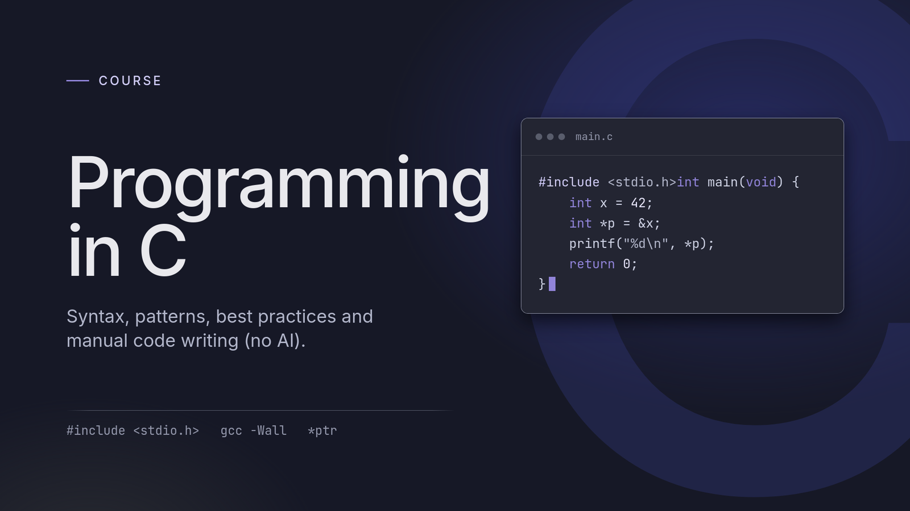

# C course

[](https://www.open-std.org/jtc1/sc22/wg14/)
[](https://gcc.gnu.org/)
[](https://memnoc.dev/writing/lets_learn_c_no-ai_0/)

Small programs and exercises for **Let's learn C (NO AI)**, following K&R's
*The C Programming Language*, second edition. Start with the Intro, then build
and experiment with the examples yourself.

## Lessons

| Lesson | Code | Notes |
| --- | --- | --- |
| 0 - Intro | - | [Start here](https://memnoc.dev/writing/lets_learn_c_no-ai_0/) |
| 1 - Hello World | [Examples](lesson_1/) | [Read the lesson](https://memnoc.dev/writing/lets_learn_c_no-ai_1/) |
| 2 - Temperature conversion | [Examples and exercises](lesson_2/) | In progress |

## Run your first program

You'll need **Git**, **GCC**, and a terminal. On Linux or macOS with GCC installed:

```sh
git clone https://github.com/Memnoc/C_course.git
cd C_course/lesson_1
gcc -Wall -Wextra -Wpedantic hello_world.c -o hello_world
./hello_world
```

Expected output: `Hello, World!`

## Look a little deeper

Run these from `lesson_1/`:

```sh
gcc -S hello_world.c                  # Read the generated hello_world.s
gcc -S -O2 hello_world.c -o optimized.s # Compare optimized assembly (capital O)
man 3 printf                         # C library documentation, when installed
```

Change a line, rebuild, and observe what happens. Each lesson's code lives in
its own numbered folder.
